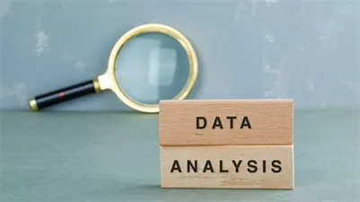

# Hi

## Welcome to the first part of the introduction to _Data Analysis with Python_
This is a complete course structure to take you through Data analysis, step-by-step

> *NOTE* The course is structured systematically, skip only if you have covered that particular area, use the links in the `Summary of lessons` to navigate through everything. ENJOY!

## Summary of Lessons
- Setup and installations
- Markdowns
- Understanding the data analysis process

# Setup and installations

Data analysis has greatly moved from a programming language called `R` to `Python`. 
This migration happened due to the flexible libraries python has due to its growing community making data analysis far easier.

The tool to be used for this course is `Jupyter notebook`.
It is a web application for python programming mainly
