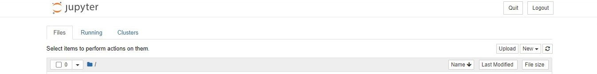
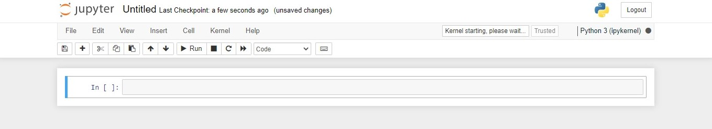

ei,ee
Well done making it this far! 🎊
As mentioned ealier, data has many sources and it is important to be conversant with the sources to be a professional data analyst. Gahering is one of the most important stages.

## Importing Datasets visually
### Step 1 - Download the file / Locate the file on your device
The first stage in working with data in the jupyter workbook is to import the data visually.
In this part of the tutorial, we are going to be working with data collected in a bike event.
> Click [here](https://drive.google.com/file/d/1F7969SsIB5Y2Iu5umJacoLC9xQMQQnnI/view?usp=sharing) to download the data for us to move together.

_You should see the image below when you click on the data link._

> Click on the download button on the upper right corner of your screen for the data to be stored on your computer. Kindly verify the download saved directory on your pc to know where the data would land during and after download.

### Step 2 - Upload it on Jupyter Notebook
Open Jupyter notebook as explained in the earlier parts of the tutorial and click on `Upload`.

- Navigate to where you stored the download data file
- Select the file `Bike_trip_data.csv`.

> The file should now exist among the few ones you see on the homepage of Jupyter Notebook.

### Step 3 - Click on `new` beside upload and choose `python 3 (ipykernel)`

> Below is how a fresh python page should look like

### Get Started.. 

- Rename the file by double-clicking on `Untitled`.
- Hit on the `+` sign on the upper left corner of the new page.
