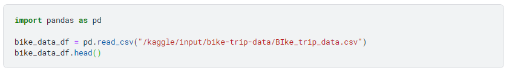

## This is the continuation

### Our target 🎓
* Import downloaded data - [Bike_trip_data](https://drive.google.com/file/d/1F7969SsIB5Y2Iu5umJacoLC9xQMQQnnI/view?usp=sharing)
* Access the data

> NOTE: Follow the instructions in the [previous lesson](https://github.com/EphraimOAgyeman/Data-Analysis-Complete-Tutorials/blob/70b138f1c4bc7daa0a7c7b489189f62dbb3f8711/%232%20Data%20Wrangling/1b.%20Data%20Gathering%20Programatically.md) to learn to import the data into jupyter labs

## Introduction to `pandas`
 
